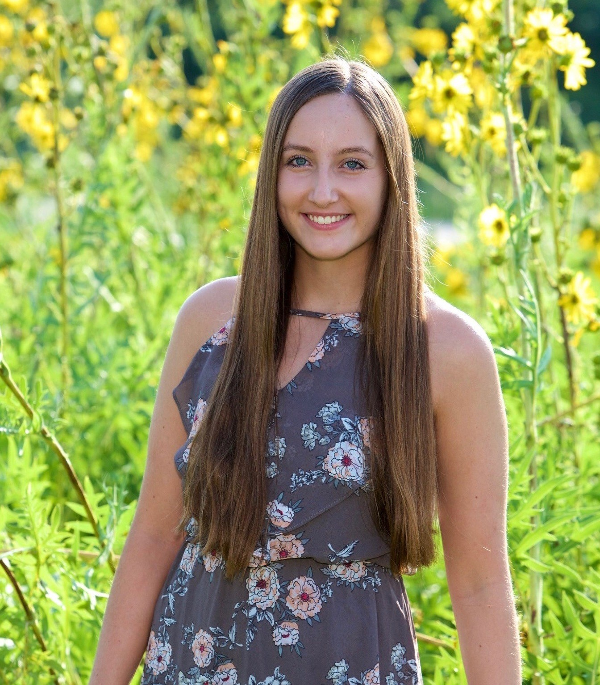

I am a current undergraduate student at the [University of Michigan](https://lsa.umich.edu/neurosci) pursuing a career in medicine. 

In furthering this passion, I engage in clincial research projects at [Spectrum Health](https://www.spectrumhealth.org/research-and-clinical-trials/who-we-are/office-of-research-administration) in Grand Rapids, MI as well as [Michigan Medicine](https://www.uofmhealth.org/our-locations/cardiovascular-center)'s Frankel Cardiovascular Center in Ann Arbor. I also actively volunteer at the University hospitals and participate in pre-medical student organizations on campus. 

Beyond my scientific academics, I have strong interests in Spanish language and culture, fitness, and community outreach.

Please reach out using the provided contact links above for any additional information.